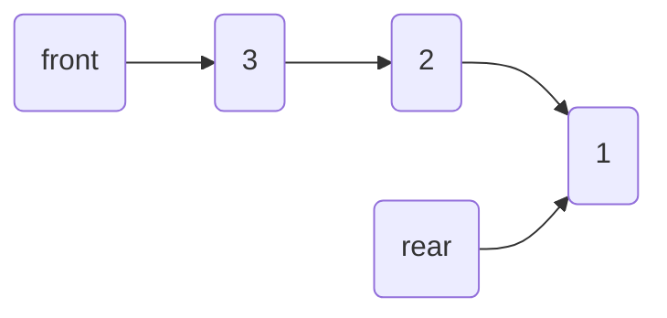
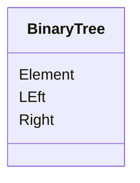

最近在重新复习数据结构，笔记是根据中国MOOC上浙大的数据结构课程整理的
不定期更新

## 前言

系统学习数据结构

课程地址：https://www.icourse163.org/learn/ZJU-93001

## 一、基本概念

### 1.什么是数据结构

#### 1.1其他定义

- 数据结构是数据对象，以及存在于该对象的实例和组成实例的数据元素之间的各种联系。这些联系可以通过定义相关的函数来给出。 ——Sartaj Sahni 《数据结构、算法与应用》
- 数据结构是 ADT（Abstract Data Type，数据抽象类型）的物理实现。 ——Clifford A.Shaffer 《数据结构与算法分析》
- 数据结构（data structure）是计算机中存储、组织数据的方式。通常情况下，精心选择的数据结构可以带来最优效率的算法。 ——中文维基百科

#### 1.2解决问题方法的效率

- 跟数组的组织方式有关

- 跟空间的利用效率有关

- 跟算法的巧妙程度有关

  ##### 计算运行时间

  Q:函数单次运行时间过短？

  A:让被测函数重复运行多次，取平均时间

计算被测函数运行时间模版

```c++
#include<stdio>
#include<time.h>
clock_t start,end;
double duration;
int main(){
  start = clock();
  MyFunction();
  stop = clock;
  duration = (double(stop - start)/CLK_TCK);
  return
}
```

#### 1.3 最终定义

- 数据对象在计算机中的组织方式
  - 逻辑结构
  - 物理存储结构
- 数据对象必定与一系列加在其上的操作相关联
- 完成这些操作所用的方法就是算法

#### 1.4 抽象数据类型（Abstract Data Type）

- 数据类型

  - 数据对象集
  - 数据集合相关联的操作集

- 抽象：描述数据类型的方法不依赖于具体实现

  - 与存放数据的机器无关
  - 与数据存储的物理结构无关
  - 与实现操作的算法和编程语言均无关

  抽象不关心具体实现细节，关心的是宏观程度上把握程序的整体架构

### 2.什么是算法

#### 2.1.定义

- 一个有限指令集
- 接受一些输入
- 一定在有限步骤之后终止

- 每一条指令必须
  - 有充分明确的目标，不可以有歧义
  - 计算机能处理范围内
  - 描述应不依赖于任何一种计算机语言以及具体的实现手段

#### 2.2 描述算法的手段

1. 空间复杂度 S(n)

   根据算法写成的程序在执行时**占用存储空间的长度**

2. 时间复杂度 T(n)

   根据算法写成的程序在执行时**耗费的时间的长度**

递归函数每递归一次，都需要将parent process的寄存器信息压入栈中

#### 2.3 评价

在分析一般算法的效率时，常常关注

1. 最坏情况复杂度 $ T_{worst}(n) $

2. 平均情况复杂度 $T_{avg}(n) $

$$
T_{arg}(n) \le T_{worst}(n)
$$

一般情况下更多关注的是最坏情况复杂度

#### 2.4 复杂度的渐进表达

- $T(n)=O(f(n))$ 表示存在常数$C>0，n_0>0 $使得当 $n \ge n_0$时有$T(n)≤C⋅f(n)$, 即 $O(f(n))$表示 $f(n)$是 $T(n) $的某种上界
- $T(n)=Ω(g(n))$ 表示存在常数$C>0，n_0>0 $使得当 $n \ge n_0$时有$T(n)≤C⋅g(n)$, 即 $Ω(g(n))$表示 $f(n)$是 $T(n) $的某种下界
- $T(n)=θ(h(n))$ 表示存在常数$C>0，n_0>0 $使得当 $n \ge n_0$时有$T(n)≤C⋅h(n)$, 即 $θ(f(n))$表示 $f(n)$是 $T(n) $的上界也是下界

#### 2.5 复杂度分析小窍门

1. 若两段算法分别有复杂度 $T_1(n)=O(f1(n))$和$T_2(n) = O(f_2(n))$，则

- $T_1(n)+T_2(n)=max(O(f_1(n)),O(f_2(n)))$
- $T_1(n)\times T_2(n)=O(f_1(n))\times O(f_2(n))$

2. 若$T(n)$是关于$n$的$k$阶多项式，那么$T(n)=\theta(n^k)$
3. 一个 for 循环的时间复杂度等于循环次数乘以循环体代码的复杂度

4. if-else 结构的复杂度取决于 if 的条件判断复杂度和两个分枝部分的复杂度，总体复杂度取三者中最大

### 3. 最大子列集问题

题目：给定N个整数的序列$\{A_1,A_2,A_3,...,A_N\}$求函数$f(i,j)=max\{0,\sum_{k=0}^j A_k \}$

##### 算法一（暴力法）：

```C
int MaxSubseqSum1(int A[],int N){
  int ThisSum, MaxSum = 0;
  int i, j, k;
  for(i=0, i<N; i++){/*子列左端*/
    for(j=i; j<N; j++){/*子列右端*/
      ThisSum = 0;
      for(k=i; k<=j; k++)
        ThisSum += A[k];
      if(ThisSum > MaxSum)
        MaxSum = ThisSum;
    }
  }
  return MaxSum;
}
```

时间复杂度：$O(N^3)$

改进方法：每次计算ThisSum是不必重新计算，只需与后续元素直接相加

##### 算法二（改进暴力法）：

```c
int MaxSubseqSum2(int A[],int N){
  int ThisSum, MaxSum = 0;
  int i, j, k;
  for(i=0, i<N; i++){/*子列左端*/
    for(j=i; j<N; j++){/*子列右端*/
      ThisSum += A[j];
      if(ThisSum > MaxSum)
        MaxSum = ThisSum;
    }
  }
  return MaxSum;
}
```

时间复杂度：$O(N^2)$

##### 算法三（分而治之）：

```c
 int Max3( int A, int B, int C )
{ /* 返回3个整数中的最大值 */
    return A > B ? A > C ? A : C : B > C ? B : C;
}
 
int DivideAndConquer( int List[], int left, int right )
{ /* 分治法求List[left]到List[right]的最大子列和 */
    int MaxLeftSum, MaxRightSum; /* 存放左右子问题的解 */
    int MaxLeftBorderSum, MaxRightBorderSum; /*存放跨分界线的结果*/
 
    int LeftBorderSum, RightBorderSum;
    int center, i;
 
    if( left == right )  { /* 递归的终止条件，子列只有1个数字 */
        if( List[left] > 0 )  return List[left];
        else return 0;
    }
 
    /* 下面是"分"的过程 */
    center = ( left + right ) / 2; /* 找到中分点 */
    /* 递归求得两边子列的最大和 */
    MaxLeftSum = DivideAndConquer( List, left, center );
    MaxRightSum = DivideAndConquer( List, center+1, right );
 
    /* 下面求跨分界线的最大子列和 */
    MaxLeftBorderSum = 0; LeftBorderSum = 0;
    for( i=center; i>=left; i-- ) { /* 从中线向左扫描 */
        LeftBorderSum += List[i];
        if( LeftBorderSum > MaxLeftBorderSum )
            MaxLeftBorderSum = LeftBorderSum;
    } /* 左边扫描结束 */
 
    MaxRightBorderSum = 0; RightBorderSum = 0;
    for( i=center+1; i<=right; i++ ) { /* 从中线向右扫描 */
        RightBorderSum += List[i];
        if( RightBorderSum > MaxRightBorderSum )
            MaxRightBorderSum = RightBorderSum;
    } /* 右边扫描结束 */
 
    /* 下面返回"治"的结果 */
    return Max3( MaxLeftSum, MaxRightSum, MaxLeftBorderSum + MaxRightBorderSum );
}
 
int MaxSubseqSum3( int List[], int N )
{ /* 保持与前2种算法相同的函数接口 */
    return DivideAndConquer( List, 0, N-1 );
}
```

时间复杂度：$O(NlogN)$
$$
T(N) = 2T(N/2)+cN, \qquad T(1)=O(1)\\
=2[2T(N/2^2)+c N/2]+cN\\
其中N/2^k=1
$$

##### 算法四（在线处理）：

```c
int MaxSubseqSum4(int A[],int N){
  int ThisSum, MaxSum = 0;
  int i, j, k;
  for(i=0, i<N; i++){
    ThisSum += A[i];/*向右累加*/
    if(ThisSum > MaxSum)
      MaxSum = ThisSum;
    else if(ThisSum<0)/*当前子列和为负*/
      ThisSum = 0;/*则不可能使后面的部分和增大，抛弃*/
  }
  return MaxSum;
}
```

时间复杂度：$O(N)$

## 二、线性结构

### 1.线性表及其实现

#### 1. 1什么是线性表

 “线性表”：由同类型数据元素构成有序序列的线性结构

- 表中元素个数称为线性表的**长度**
- 线性表没有元素时，称为**空表**
- 表起始位置称为**表头**，表结束位置称**表尾**

#### 1.2线性表的抽象数据类型描述

- 类型名称：线性表（List）

- 数据对象集：线性表是 $n(≥0)$个元素构成的有序序列$(a_1,a_2,...,a_n)$

- 操作集：线性表 $L\in List$ ，整数 i 表示位置，元素 $X\in ElementType$

- 线性表基本操作主要有：
  - `List MakeEmpty()`： 初始化一个空线性表 L
  - `ElementType FindKth(int K,List L)`：根据位序 K，返回相应元素
  - `int Find(ElementType X,List L)`：在线性表 L 中查找 X 的第一次出现位置
  - `void Insert(ElementType X,int i,List L)`：在位序 i 前插入一个新元素 X
  - `void Delete(int i,List L)`：删除指定位序 i 的元素
  - `int Length(List L)`：返回线性表 L 的长度 n

#### 1.3存储实现方法

##### 1.3.1顺序存储实现

```C
typedf struct LNode *List;
struct LNode{
  ElementType Data[MAXSIZE];
  int Last;
};
struct LNode L;
List PtrL;

/*initail*/
List MakeEmpty(){
  List PtrL;
  PtrL = (List)malloc(sizeof(struct LNode));
  PtrL->Last = -1;
  return PtrL;
}

/*Find element*/
int Find(ElementType X,List PtrL){
  int i = 0;
  while(i <= PtrL->Last && PtrL->Data[i]!=X)i++;
  if(i > PtrL->Last) return -1;
  else return i;
}

/*insert element*/
void Insert(ElementType X,int i,List PtrL){
  int j;
  if(PtrL->Last == MAXSIZE-1){
    printf("Full");
    return;
  }
  if(i<1 || i>PtrL->Last+2){
    printf("unfair position");
    return;
  }
  for(j=PtrL->Last; j>=i;j--){
    PtrL->Data[j+1] = PtrL->Data[j];
  }
  PtrL->Data[i-1] = X;
  PtrL->Last++;
  return;
}
/*平均移动次数为n/2*/
/*平均时间性能是O（n）*/

void Delete(int i,List PtrL){
  int j;
  if(i<1 || i>PtrL->Last+1){
    printf("不存在第%d个元素",i);
    return;
  }
  for(j=i; j<=PtrL->Last; j++){
    PtrL->Data[j-1] = PtrL->Data[j];
  }
  PtrL->Last--;
}
/*平均移动次数为(n-1)/2*/
/*平均时间性能是O（n）*/
```

##### 1.3.1链式存储实现

 不要求逻辑上相邻的两个元素物理上也相邻，通过"链"建立起数据之间的逻辑关系

- 插入、删除不需要移动数据元素，只需要修改"链"

```C
typedef int ElementType; // ElementType 可定义为任意类型
typedef struct LNode *List;
struct LNode{
	ElementType Data;   //数据域 
	List Next;   // 下一个链表的地址 
}; 
List L;

List MakeEmpty(); //初始化链表 
int Length(List L);  // 以遍历链表的方法求链表长度 
List FindKth(int K,List L);  // 按序号查找 
List Find(ElementType X,List L);  // 按值查找 
List Insert(ElementType X,int i,List L);  //将 X 插入到第 i-1(i>0) 个结点之后 
List Delete(int i,List L); // 删除第 i(i>0) 个结点 
void Print(List L); // 输出链表元素 

// 初始化链表 
List MakeEmpty(){
	List L = (List)malloc(sizeof(struct LNode));
	L = NULL;
	return L;
}

//求表长 
int Length(List L){
	List p = L;
	int len=0;
	while(p){  // 当 p 不为空 
		p = p->Next;
		len++;
	}
	return len;
} 

// 按序查找 
List FindKth(int K,List L){
	List p = L;
	int i = 1;  //从 1 开始 
	while(p && i<K){
		p = p->Next;
		i++;
	}
	if(i == K)    // 找到了 
		return p;
	else    // 未找到 
		return NULL;
} 

// 按值查找  
List Find(ElementType X,List L){
	List p = L;
	while(p && p->Data!=X)
		p = p->Next;
	// 找到了，返回 p
	// 未找到，返回 NULL，此时 p 等于 NULL 
	return p;   
} 

/* 插入
1. 用 s 指向一个新的结点
2. 用 p 指向链表的第 i-1 个结点 
3. s->Next = p->Next，将 s 的下一个结点指向 p 的下一个结点 
4. p->Next = s，将 p 的下一结点改为 s   */
List Insert(ElementType X,int i,List L){
	List p,s;
	if(i == 1){     // 新结点插入在表头 
		s = (List)malloc(sizeof(struct LNode));
		s->Data = X;
		s->Next = L;
		return s;     //插入的结点为头结点 
	}
	p = FindKth(i-1,L);   // 找到第 i-1 个结点
	if(!p){   // 第 i-1 个结点不存在 
		printf("结点错误");
		return NULL;
	}else{
		s = (List)malloc(sizeof(struct LNode));
		s->Data = X;
		s->Next = p->Next;   //将 s 的下一个结点指向 p 的下一个结点 
		p->Next = s;   // 将 p 的下一结点改为 s
		return L;
	}
}

/* 删除
1. 用 p 指向链表的第 i-1 个结点 
2. 用 s 指向要被删除的的第 i 个结点
3. p->Next = s->Next，p 指针指向 s 后面
4. free(s)，释放空间 
*/
List Delete(int i,List L){
	List p,s;
	if(i==1){   //如果要删除头结点 
		s = L;
		if(L)   // 如果不为空 
			L = L->Next;
		else
			return NULL;
		free(s);   // 释放被删除结点 
		return L; 
	}
	p = FindKth(i-1,L);    // 查找第 i-1 个结点
	if(!p || !(p->Next)){     // 第 i-1 个或第 i 个结点不存在 
		printf("结点错误");
		return NULL;
	}else{
		s = p->Next;    // s 指向第 i 个结点 
		p->Next = s->Next;  //从链表删除 
		free(s);  // 释放被删除结点 
		return L;
	}
}

// 输出链表元素 
void Print(List L){
	List t;
	int flag = 1;
	printf("当前链表为：");
	for(t = L;t;t =t->Next){
		printf("%d  ",t->Data);
		flag = 0;
	}
	if(flag)
		printf("NULL");
	printf("\n"); 
}

int main(){
	L = MakeEmpty();
	Print(L);
	L = Insert(11,1,L);
	L = Insert(25,1,L);
	L = Insert(33,2,L);
	L = Insert(77,3,L);
	Print(L);
	printf("当前链表长度为：%d\n",Length(L));
	printf("此时链表中第二个结点的值是：%d\n",FindKth(2,L)->Data);
	printf("查找22是否在该链表中：");
	if(Find(22,L))
		printf("是！\n");
	else
		printf("否！\n");
	printf("查找33是否在该链表中：");
	if(Find(33,L))
		printf("是！\n");
	else
		printf("否！\n");
	L = Delete(1,L);
	L = Delete(3,L);
	printf("----------删除后-----\n"); 
	Print(L);
	return 0;
} 
```

#### 1.4广义表与多重链表

##### 1.4.1广义表

- 广义表是线性表的推广，广义表属于多重链表
- 对于线性表而言，n个元素都是基本的单元素
- 广义表中，这些元素不仅可以是单元素也可以是另一个广义表

```C
typedef struct GNode *GList;
struct Gnode{
  int Tag;/*标示域：区分是单元素还是广义表*/
  union {
    ElementType Data;
    GList SubList;
  }URegion;
  GList Next;
}
```

##### 1.4.2多重链表

- 多重链表中的结点的指针域会有多个
- 但是包含两个指针域的链表并不一定是多重链表，比如`双向链表`
- 广泛用途：树、图
- 处理稀疏矩阵（十字链表）

### 2.堆栈

#### 2.1什么是堆栈

堆栈（Stack）：具有一定操作约束的线性表

- 只在一端（栈顶，Top）做插入、删除
- 插入数据：入栈（Push）
- 删除数据：出栈（Pop）
- 后入先出：Last In First Out（LIFO）

#### 2.2堆栈的抽象数据类型描述

- 类型名称：堆栈（Stack）

- 数据对象集：一个有 0 个或多个元素的有穷线性表

- 操作集：长度为 MaxSize 的堆栈$ S ∈ Stack$，堆栈元素 $item ∈ ElementType$

堆栈的基本操作主要有：

- `Stack CreateStack(int MaxSize)`：生成空堆栈，其最大长度为 MaxSize
- `int IsFull(Stack S,int MaxSize)`：判断堆栈 S 是否已满
- `void Push(Stack S,ElementType item)`：将元素 item 压入堆栈
- `int IsEmpty(Stack S)`：判断堆栈 S 是否为空
- `ElementType Pop(Stack S)`：删除并返回栈顶元素

#### 2.3存储实现

##### 2.3.1栈的顺序存储实现

```C
#defind MaxSize <储存数据元素的最大个数>
typedef struct SNode *Stack;
struct SNode{
  ElementType Data[MaxSize];
  int Top;
}

void Push(Stack PtrS, ElementType item){
  if(Ptr->Top == MaxSize-1){
    printf("堆栈满");
    return;
  }else{
    PtrS->Data[++(PtrS->Top)] = item;
    return;
  }
}

ElementType Pop(Stack PtrS){
  if(PtrS->Top == -1){
    printf("堆栈空");
    return ERROR;
  }else{
    return (PtrS->Data[(Ptr->Top)--])
  }
}
```


> 请用一个数组实现两个堆栈，要求最大地利用数组空间，使数组只要有空间入栈操作就可以成功

```C
#defind MaxSize <储存数据元素的最大个数>
typedef struct SNode *Stack;
struct SNode{
  ElementType Data[MaxSize];
  int Top1 = -1;
  int Top2 = MaxSize;
}S;

void Push(struct DStack *PtrS, ElementType item, int Tag){
  if(PtrS->Top2 - PtrS->Top1 == 1{
    printf("堆栈满");
  }
  if(Tag == 1){
    PtrS->Data[++(PtrS->Top1)] = item;
  }else{
    PtrS->Data[--(PtrS->Top2)] = item;
  }
}     

ElementType Pop(struct DStack *PtrS, int Tag){
  if(Tag == 1){
    if(PtrS->Top1 == -1){
      printf("堆栈1空");
    }else {
      return PtrS->Data[(PtrS->Top1)--];
    }
  }else{
    if(PtrS->Top2 == -MaxSize){
      printf("堆栈2空");
    }else {
      return PtrS->Data[(PtrS->Top2)++];
  }
}
```

##### 2.3.2栈的链式存储实现

 栈的链式存储结构实际上就是一个单链表，叫做链栈。插入和删除操作只能在链栈的栈顶进行

栈顶指针Top应该在链表的首部

```C
typedef struct SNode *Stack;
struct SNode{
  ElementType Data;
  struct SNode *Next;
};

Stack CreateStack(){
  Stack S;
  S = (Stack)malloc(sizeof(struct Snode));
  S->Next = NULL;
  return S;
}

int IsEmpty(Stack S){
  return (S->Next == NULL);
}

void Push(ElementType item, Stack S){
  struct SNode *TmpCell;
  TmpCell = (struct SNode*)malloc(sizeof(struct SNode));
  TmpCell->Element = item;
  TmpCell->Next = s->Next;
  S->Next = TmpCell;
}

ElementType Pop(Stack S){
  struct SNode *FirstCell;
  ElementType TopElem;
  if(IsEmpty(S)){
    printf("堆栈空");
    return NULL;
  }else{
    FirstCell = S->Next;
    S->Next = FirstCell->Next;
    TopElem = FirstCell->Element;
    free(FirstCell);
    return TopElem;
  }
}
```

#### 2.4堆栈的应用

- 中缀表达式求值
- 函数调用及递归实现
- 深度优先搜索
- 回溯算法

### 3.队列

#### 3.1什么是队列

队列（Queue）：具有一定操作约束的线性表

- 插入和删除操作：只能在一端（front）插入，而在另一端（rear）删除
- 数据插入：入队列（AddQ）
- 数据删除：出队列（DeleteQ）
- 先进先出：FIFO

#### 3.2队列的抽象数据类型描述

- 类型名称：队列（Queue）
- 数据对象集：一个有 0 个或多个元素的有穷线性表
- 操作集：长度为 MaxSize 的队列 Q∈Queue，队列元素 item∈ElementType

队列的基本操作主要有：

- `Queue CreateQueue(int MaxSize)`：生成长度为 MaxSize 的空队列
- `int IsFull(Queue Q)`：判断队列 Q 是已满
- `void AddQ(Queue Q,ElementType item)`：将数据元素 item 插入队列 Q 中
  int IsEmpty(Queue Q)：判断队列 Q 是否为空
- `ElementType DeleteQ(Queue Q)`：将队头数据元素从队列中删除并返回

#### 3.3存储方式

##### 3.3.1顺序存储实现

队列的顺序存储结构通常由一个一维数组和一个记录队列头元素位置的变量 front 以及一个记录队列尾元素位置的变量 rear 组成，其中 front 指向整个队列的头一个元素的再前一个，rear 指向的是整个队列的最后一个元素，从 rear 入队，从 front 出队，且仅使用 n-1 个数组空间

- 队列空满状态判别？
  - 使用额外标记：Size或者tag域
  - 仅使用n-1个数组空间

```C
#defind MaxSize <储存数据元素的最大个数>
struct QNode{
  ElementType Data [Maxsize];
  int rear;
  int front;
};
typedef struct QNode *Queue;

void AddQ(Queue PtrQ, ElementType itrm){
  if(PtrQ->rear+1)%MaxSize == PtrQ->front{
    prinf("队列满");
    return;
  }
  PtrQ->rear = (PtrQ->rear+1)%MaxSize;
  PtrQ->Data[PtrQ->rear] = item;
}
 
ElementType DeleteQ(Queue PtrQ){
  if(PtrQ->front == PtrQ->rear){
    printf("队列空");
  }else{
    PtrQ->front = (PtrQ->front+1)%MaxSize;
    return PtrQ->Data[PtrQ->front];
  }
}
  
```

##### 3.3.2 队列的链式存储实现

 队列的链式存储结构也可以用一个单链表实现。插入和删除操作分别在链表的两头进行，front 在链表头，rear在链表尾，从 rear入队，从front出队



```C
struct Node{
  ElementType Data;
  struct Node *Next;
};
struct QNode{
  struct Node *rear;
  struct Node *front;
};
typedef struct QNode *Queue;
Queue PtrQ;

ElementType DeleteQ(Queue PtrQ){
  struct Node *FrontCell;
  ElementType FrontElem;
  if(PtrQ->front == NULL){
    printf("队列空");
    return ERROR;
  }
  FrontCell = PtrQ->rear;
  if(PtrQ->front == PtrQ->rear){/*若队列只有一个元素*/
    PtrQ->front = PtrQ->rear =NULL;
  }else{
    PtrQ->front = PtrQ->front->Next;
  }
  FrontElem = FrontCell->Data;
  free(FrontCell);
  return FrontE;em;
}
```

## 三、非线性结构

### 3.树

#### 3.1树与树的表示

##### 3.1.1树的定义

树（Tree）：$n（n≥0）$个结点构成的有限集合

当 n=0 时，称为**空树**

对于任意一个非空树。它具有以下性质：

- 树中有一个称为“根”的特殊结点，用r表示
- 其余结点m个非零互不相交的特殊结点，其中每个集合本身又是一颗树，称为原来树的“子树”，只有一个父结点

##### 3.1.2树的基本术语

- 结点的度（Degree）：结点的子树个数
- 树的度：树的所有结点中最大的度数
- 叶结点（Leaf）：度为 0 的结点
- 父结点（Parent）：有子树的结点是其子树的根结点的父结点
- 子结点（Child）：若 A 结点是 B 结点的父结点，则称 B 结点是 A 结点的子结点，也称孩子结点
- 兄弟结点（Sibling）：具有同一父结点的各个结点彼此是兄弟结点
- 路径长度：路径所包含边的个数
- 路径长度：从结点$n_1$到$n_k$的路径为一个结点序列$n_1,n_2,...,n_k$
- 祖先结点（Ancestor）：沿树根到某一结点路径上的所有结点都是这个结点的祖先结点
- 子孙结点（Descendant）：某一结点的子树中的所有结点是这个结点的子孙
- 结点的层次（Level）：规定根结点在 1 层，其他任一结点的层数是其父结点的层数加一
- 树的深度（Depth）：树中所有结点中的最大层次是这棵树的深度

##### 3.1.2树的表示

- 儿子兄弟表示法

#### 3.2二叉树及其村粗

##### 3.2.1定义

- 二叉树 T：一个有穷的结点集合

- 这个集合可以为空

- 若不为空，则它是由根结点和称为其左子树$T_L$ 和右子树$T_R$的两个不相交的二叉树组成
- 二叉树的子树有左右顺序之分

##### 3.2.2二叉树几个重要性质

- 一个二叉树第i层的最大结点数为$2^{i-1},i \geq1$
- 深度为k的二叉树有最大结点总数为：$2^{k}-1,k\geq1$
- 对任何非空二叉树T，若$n_0$表示叶结点的个数，$n_2$表示度为2的非叶结点个数，那么两者满足关系$n_0=n_2+1$

##### 3.2.2抽象数据类型定义

- 数据对象集：一个有穷的结点集合，若不为空，则由根结点和其左、右二叉子树组成
- 操作集：BT ∈ BinTree，Item ∈ ElementType
- 主要操作有：
  - Boolean IsEmpty(BinTree BT)：判别 BT 是否为空
  - void Traversal(BinTree BT)：遍历，按某顺序访问每个结点
  - BinTree CreatBinTree()：创建一个二叉树
- 常用的遍历方法有：
  - void PreOrderTraversal(BinTree BT)：先序——根、左子树、右子树
  - void InOrderTraversal(BinTree BT)：中序——左子树、根、右子树
  - void PostOrderTraversal(BinTree BT)：后序——左子树、右子树、根
  - void LevelOrderTraversal(BinTree BT)：层次遍历，从上到下、从左到右

##### 3.2.3二叉树的存储结构

1. 顺序存储结构

   1. 完全二叉树

   - 非根结点（序号i>1）的父结点的序号为$\lfloor i/2 \rfloor $;
   - 结点（序号为i）的左孩子结点的序号为2i，（若$2i\leq n $，否则没有左孩子）
   - 结点（序号为i）的右孩子结点的序号为2i+1

   2.一般二叉树也可采用顺序结构，但是浪费空间

2. 链表存储

```c++
typedef struct TreeNode *BinTree;
struct TreeNode{
	Element Data;  // 存值 
	BinTree Left;    // 左儿子结点 
	BinTree Right;   // 右儿子结点 
};
```



#### 3.3二叉树的遍历

##### 3.3.1先序遍历

遍历过程：

1. 先访问根结点
2. 先序遍历其左子树
3. 先序遍历其右子树

- 递归实现

```c++
void PreOrderTraversal(BinTree BT){
  if(BT){
    printf("%d",BT->Data);
    PreOrderTraversal(BT->Left);
    PreOrderTraversal(BT->Right);    
  }
}
```

- 非递归实现

```c++
void PreOrderTraversal(BinTree BT){
  BinTree T=BT;
  Stack S = CreatStack(MaxSize);
  while(T || !IsEmpty(S)){
    while(T){
      Push(S,T);
      T = T->Left;
      printf("%5d",T->Data);
    }
    if(!Isempty(S)){
      T = Pop(S);
      T = T->Right;
    }
  }
}
```


##### 3.3.2中序遍历

遍历过程：

1. 中序遍历其左子树
2. 访问根结点
3. 中序遍历其右子树

- 递归实现

```c++
void InOrderTraversal(BinTree BT){
	if(BT){
		InOrderTraversal(BT->Left);  // 进入左子树 
		printf("%d",BT->Data);  // 打印根 
		InOrderTraversal(BT->Right);  // 进入右子树 
	} 
}
```

- 非递归实现

```c++
void InOrderTraversal(BinTree BT){
  BinTree T=BT;
  Stack S = CreatStack(MaxSize);
  while(T || !IsEmpty(S)){
    while(T){
      Push(S,T);
      T = T->Left;
    }
    if(!Isempty(S)){
      T = Pop(S);
      printf("%5d",T->Data);
      T = T->Right;
    }
  }
}
```


##### 3.3.3后序遍历

遍历过程：

1. 后序遍历其左子树
2. 后序遍历其右子树
3. 访问根结点

- 递归实现

```c++
void PostOrderTraversal(BinTree BT){
	if(BT){
		PostOrderTraversal(BT->Left);  // 进入左子树 
		PostOrderTraversal(BT->Right);  // 进入右子树 
		printf("%d",BT->Data);  // 打印根 
	} 
}
```

##### 3.3.4层序遍历

遍历过程：从上至下，从左至右访问所有结点

队列实现过程：

1. 根结点入队
2. 从队列中取出一个元素
3. 访问该元素所指结点
4. 若该元素所指结点的左孩子结点非空，左孩子结点入队
5. 若该元素所指结点的右孩子结点非空，右孩子结点入队
6. 循环 1 - 4，直到队列中为空

```C++
void LevelOrderTraversal (BinTree BT){
  Queue Q;
  BinTree T;
  Q = CreatQueue(MaxSize)
    AddQ(Q,BT);
  while(!IsEmptyQ(Q)){
    T = DeleteQ(Q);
    printf("%d\n",T->Data);
    if(T->Left)AddQ(Q,T->Left);
    if(T->Right)AddQ(Q,T->Right);
  }
}
```

##### 3.3.5几个例子

- 遍历二叉树的应用：输出二叉树中的叶子结点。（遍历算法+检测结点是否为空）

```c++
void  FindLeaves(BinTree BT){
	if(BT){
		if( !BT->Left && !BT->Right)
			printf("%d",BT->Data);  // 打印叶子结点
		FindLeaves(BT->Left);  // 进入左子树 
		FindLeaves(BT->Right);  // 进入右子树 
	}
} 

```

- 二叉树的高度（后序遍历）

```c++
int  GetHeight(BinTree BT){
	int hl,hr,maxh;
	if(BT){
		hl = GetHeight(BT->Left);  // 求左子树高度 
		hr = GetHeight(BT->Right);  // 求右子树高度 
		maxh = (hl>hr)?hl:hr;
		return maxh+1;  // 当前结点高度为左右子树最大的高度+1 
	}else
		return 0;
} 
```

- 二元运算表达式树及其遍历
- 由两种遍历序列确定二叉树（必须要有中序遍历）

#### 3.4二叉树搜索树

##### 3.4.1定义

一颗二叉树，可以为空；如果不为空，满足以下性质：

- 非空左子树的所有键值小于其根结点的键值
- 非空右子树的所有键值大于其根结点的键值
- 左、右子树都是二叉搜索树

##### 3.4.2二叉搜索树操作的特殊函数

- Position Find( ElementType X,BinTree BST):从二叉搜索树BST中查找元素X，返回其所在结点的地址；

```c++
Position Find(ElementType X, BinTree BST){
  if(!BST)return NULL;
  if(X>BST->Data)return Find(X,BST->Right);
    Else if(X<BST->Data)return Find(X,BST->Left);
  else
    return BST;
}

Posistion IterFind(ElementType X,BinTree BST){
  while(BST){
    if(X>BST->Data){
      BST = BST->Right;
    }
    else if(X < BST->Data){
      BST = BST->left;
    }
    else 
      return BST;
  }
  return NULL;
}
```


- Position FindMin(BinTree BST):从二叉搜索树BST中查找并返回最小元素所在结点的地址；

```c++
Position FindMin(BinTree BST){
  if(!BST)return NULL;
  else if(!BST->Left)
    return BST;
  else 
    return FindMin(BST->Left);
}
```

- Position FindMax(BinTree BST):从二叉搜索树BST中查找并返回最大元素所在结点的地址;

```c++
Position FindMax(BinTree BST){
  if(BST){
    while(BST->Right)BST = BST->Right;
  }
  return BST;
}
```

##### 3.4.3二叉搜索树的插入

```c++
BinTree Insert(ElementType X,BinTree BST){
  if(!BST){
    BST = malloc(sizeof(struct TreeNode));
    BST->Data = X;
    BST->Left = BST->Right = NULL;
  }else{
    if(X < BST->Data){
      BST->Left = Insert(X,BST->Left);
    }
    else if(X > BST->Data){
      BST->Rigth = Insert(X,BST->Right);
    }
  }
  return BST;
}
```

##### 3.4.3二叉搜索树的删除

考虑三种情况：

1. 叶结点
2. 只有一个孩子
3. 有左、右两颗子树(找**左子树最大**或者**右子树最小**)

```c++
BinTree Delete(ElementType X,BinTree BST){
  Position Tmp;
  if(!BST)printf("要删除的元素未找到");
  else if(X<BST->Data){
    BST->Left = Delete(X,BST->Left);
  }
  else if(X<BST->Data){
    BST->Right = Delete(X,BST->Right);
  }
  else{
    if(BST->Left && BST->Rigth){
      Tmp = FindMin(BST->Right);
      BST->Data = Tmp->Data;
      BST->Right = Delete(BST->Data,BST->Right);
    }
    else{
      Tmp = BST;
      if(!BST->Left){
        BST = BST->Right;
      }
      else if(!BST->Right){
        BST = BST->Left;
      }
      free(Tmp);
    }
  }
  return BST;
}
```


#### 3.5平衡二叉树

##### 3.5.1什么是平衡二叉树(根结点高度为0)

空树，或者任一结点左、右子树高度差的绝对值不超过1，即$|BF(T)|\le1$

$n_h=n_{h-1}+n_{h-2}+1$

##### 3.5.2平衡二叉树的调整


#### 3.6堆

##### 3.6.1什么是堆

优先队列：特殊的“队列”，取出元素的顺序是依照元素的优先权（关键字）大小，而不是进入队列的先后顺序。

两个特性

- 结构性：用**数组**表示的**完全二叉树**
- 有序性：任一结点的关键字是其子树所有结点的最大值（或最小值）
  - “最大堆(MaxHeap)”，也称"大顶堆"：最大值
  - “最小堆(MinHeap)”，也称"小顶堆"：最小值

##### 3.6.2堆的抽象数据类型描述

```c++
typedef struct HeapStruct "MaxHeap";
struct HeapStruct{
  ElementType "Element";
  int Size;
  int Capacity;
};
```


主要操作有：

- MaxHeap Create(int MaxSize)：创建一个空的最大堆

```c++
MaxHeap Create(int MaxSize){
  MaxSize H = malloc(sizeof (struct HeapStruct));
  H->Elements = malloc((MaxSize+1)*sizeof(ElementType));
  H->Size = 0;
  H->capacity = MaxSize;
  H->Element[0] = MaxData;
  return H;
}
```

- Boolean IsFull(MaxHeap H)：判断最大堆 H 是否已满
- Boolean Insert(MaxHeap H,ElementType item)：将元素 item 插入最大堆 H$T(N)=O(log(n))$

```c++
void Insert(MaxHeap H,ElementType item){
  int i;
  if(IsFull(H)){
    prints("最大堆已满");
    return;
  }
  i = ++H->Size;
  for(; H->Element[i/2] < item; i/=2){
    H->Element[i] = H->Elements[i/2];
  }
  H->Element[i] = item;
}
```

- Boolean IsEmpty(MaxHeap H)：判断最大堆 H 是否为空
- ElementType DeleteMax(MaxHeap H)：返回 H 中最大元素（高优先级）

```c++
Element DeleteMax(MaxHeap H){
  int parent, Child;
  ElementType MaxItem, temp;
  if(IsEmpty(H)){
    printf("最大堆已为空");
    return;
  }
  Maxitem = H->Element[1];
  temp = H->Element[H->Size--];
  for(parent=1; Parent*2<=H->Size;Parent=Child){
    child = Parent * 2;
    if((Child!=H->Size)&&(H->Elements[Child] < H->Elements[Child+1]))Child++;
    if(temp >= H->Element[Child])break;
    else H->Elements[Parent] = H->Elements[Child];
  }
  H->Elements[Parent] = temp;
  return MaxItem;
}
```

#### 3.7哈夫曼树与哈夫曼编码

##### 3.7.1哈夫曼树的定义

带权路径长度（WPL）:设二叉树有n个叶子结点，每个叶子结点带有权值$w_k$，从根结点到每个叶子结点的长度为$l_k$，则每个叶子结点的带权路径长度之和就是：$WPL=\sum{w_kl_l}$

哈夫曼树就是最优WPL

##### 3.7.2哈夫曼树的构造 $O(NlogN)$

```c++
typedef struct TreeNode *HuffmanTree;
struct TreeNode{
  int Weight;
  HuffmanTree Left, Right;
}
HuffmanTree Huffman(MinHeap H){
  int i;
  HuffmanTree T;
  BuildMinHeap(H);
  for(i = 1; i<H->Size; i++){
    T = malloc(sizeof(struct TreeNode));
    T->Left = DeleteMin(H);
    T->Right = DeleteMin(H);
    T->Weigth = T->Left->Weight + T->Right->Weight;
    Insert(H,T);
  }
  T = DeleteMin(H);
  return T;
}
```

##### 3.7.3哈夫曼数的特点

- 没有度为1的结点
- n个叶子结点的哈夫曼树共有2n-1个
- 哈夫曼树的任意非叶结点的左右子树交换后仍然是哈夫曼树
- 对于同一组权值存在不同构的两个哈夫曼树

##### 3.7.4哈夫曼编码（不等长编码）

根据频率构造

#### 3.8并查集

##### 3.8.1表示方法

数组存储

```c++
typedef struct{
  ElementType Data;
  int Parent;
}SetType;
```

##### 3.8.2集合运算

- 查找某个元素所在的集合

```c++
int Find(SetType S[], ElementType X){
  int i;
  for(i=0; i<MaxSize && S[i].Data != X; i++);
  if(i >= MaxSize) return -1;
  for(;S[i].Parent >= 0; i = S[i].Praent);
  return i;
}
```

- 并运算

```c++
void Union(SetType S[], ElementType X1, ElementType X2){
  int Root1, Root2;
  Root1 = Find(S,X1);
  Root2 = Find(S,X2);
  if(Root1 != Root2)S[Root2].Parent = Root1;
}
```

### 4.图

#### 4.1什么是图

##### 4.1.1定义

表示多对多的关系

包含

- 一组顶点：通常用V（Vertex）表示顶点集合
- 一组边：通常用E（Edge）表示边的集合
  - 边是顶点对
  - 有向边<v,w>表示从v指向w的边
  - 不考虑重边和自回路

##### 4.1.2抽象数据类型定义

- 类型名称：图

- 数据对象集：G（V，E）由一个非空的有限顶点集合v和一个有限边集合E组成

- 操作集：对于任意图$G\in Graph$，以及$v\in V,e\in E$

  - Graph Create():

  - Graph InsertVertex(Graph G,Vertx v):

  - Graph InsertEdge(Graph G,Edge e):

  - void DFS(Graph G,Vertex v):

  - void BFS(Graph G,Vertex v):

    ......

##### 4.1.3常见术语

- 无向树
- 有向树

##### 4.1.4表示方法

1.邻接矩阵

用一个长度为N(N+1)/2的一维数组A存储${G_{00},G_{10},G_{11},...}$，则$G_{ij}$在A中对应的下标为：（i*（i+1）/2+j）

2.邻接表

#### 4.2图的遍历

##### 4.2.1DFS

```c++
void DFS(Vertex V){
  visited[V] = true;
  for (V的每个邻接点W)
    if（！visited[W]）
    		DFS(W);
}
```

类似于先序遍历

- 用邻接表存储图，有$O(N+E)$
- 用邻接矩阵存储图，有$O(N^2)$

##### 4.2.2BFS

类似于层序遍历

```c++
void BFS(Vertex V){
  visited[V] = true;
  Enqueue(V,Q);
  while(!IsEmpty(Q)){
    V = Dequeue(Q);
    for(V的每个邻接点W)
      if(!visited[W]){
        visited[W] = true;
        Enqueue(W,Q);
      }
  }
}
```

- 用邻接表存储图，有$O(N+E)$
- 用邻接矩阵存储图，有$O(N^2)$

#### 4.3最短路径

在网络中，求两个不同顶点之间的所有路径中，边的权值之和最小的那一条路径

##### 4.3.1单源最短路径问题

###### 4.3.1.1无权图的单源最短路算法

按照**递增**的顺序找出到各个顶点的最短路径

```c++
void Unweighted(Vertex S){
  Enqueue(S,Q);
  while(!IsEmpty(Q)){
    V = Dequeue(Q);
    for(V的每个邻接点W)
      if(dist[W]==-1){
        dist[W] = dist[V]+1;
        path[W] = V;
        Enqueue(W,Q);
      }
  }
}
```

$T=O(|V|+|E|)$

###### 4.3.1.2有权图的单源最短路算法

- Dijkstra算法

```c++
void Dijkstra(Vertex s){
  while(1){
    V = 未收录顶点中dist最小者;
    if(这样的V不存在)break;
    collected[V] = true;
    for(V的每个邻接点)
      if(collected[W]==false)
        if(dist[V]+E[V][W] < dist[W]){
          dist[W] = dist[V]+E[V][W];
          path[W] = V;
        }
  }
}
```

##### 4.3.2多源最短路径问题

- Floyd算法

```c++
void Floyd(){
  for(i=0; i<N; i++)
    for(j=0; j<N; j++){
      D[i][j] = G[i][j];
      path[i][j] = -1;
    }
  for(k=0; k<N; K++)
    for(i=0; i<N; i++)
      for(j=0; j<N; j++){
        if(D[i][k]+D[k][j]<D[i][j]){
          D[i][j] = D[i][k]+D[k][j];
          path[i][j] = k;
        }
      }
  
}
```

#### 4.4 最小生成树(Minimum Spanning Tree)

##### 4.4.1 什么事最小生成树

- 是一棵树
  - 无回路
  - |V|个顶点一定有|V|-1条边
- 是生成树
  - 包含全部顶点
  - |V|-1条边都在图里
- 边的权重和最小

##### 4.4.2 解决方法——贪心算法

###### 4.4.2.1 Prim算法（生长）

```c++
void Prim(){
  MST = {s};
  while(1){
    V = 未收录顶点中dist最小者;
    if(这样的V不存在)break;
    将V收录进MST: dist[V] = 0;
    for(V的每个邻接点W){
      if(W未被收录){
        if(E[V][W]<dist[W]){
          dist[W] = E[V][W];
          parent[W] = V;
        }
      }
    }
  }
  if(MST中收的顶点不到V个)
    Error("生成树不存在");
}
```

###### 4.4.2.2 Kruskal算法(直接选择最小边)——稀疏图

```c++
void Kruskal(Graph G){
  MST = {};
  while(MST中不到V-1条边 && E中还有边){
    从E中取一条权重最小的边E[V][W];
    将E[V][W]从E中删除;
    if(E[V][W]不在MST中构成回路){//并查集
      将E[V][W]加入MST;
    }
    else{
      彻底无视E[V][W];
    }
  }
}
```

#### 4.5 拓扑排序

##### 4.5.1 什么是拓扑排序

- 拓扑序

如果图中从V到W有一条有向路径，则V一定排在W之前。满足此条件的顶点序列称为一个拓扑序，获得拓扑序的过程就是**拓扑排序**

**AOV**如果有合理的拓扑序，则必定是有向无环图(Directed Acyclic Graph,DAG)

4.5.2伪代码实现

```c++
void TopSort(){
  for (cnt = 0; cnt < |V|; cnt++){
    V = 未输入的入度为0的顶点;//随时将入读为0的顶点放入一个容器
    if(这样的V不存在){
      Error("图中有回路");
      return;
    }
    输出V,或者记录V的输出序号;
    for(V的每个邻接点W)Indegree[W]--;
  }
}
```

## 5.排序

算法可视化网站[Algorithm Visualizer](https://algorithm-visualizer.org/)

|   排序方法   | 平均时间复杂度 | 最坏时间复杂度 | 额外空间复杂度 | 稳定性 |
| :----------: | :------------: | :------------: | :------------: | :----: |
| 简单选择排序 |    $O(N^2)$    |    $O(N^2)$    |     $O(1)$     | 不稳定 |
|   冒泡排序   |    $O(N^2)$    |    $O(N^2)$    |     $O(1)$     |  稳定  |
| 直接插入排序 |    $O(N^2)$    |    $O(N^2)$    |     $O(1)$     |  稳定  |
|   希尔排序   |    $O(N^d)$    |    $O(N^2)$    |     $O(1)$     | 不稳定 |
|    堆排序    |   $O(NlogN)$   |   $O(NlogN)$   |     $O(1)$     | 不稳定 |
|   快速排序   |   $O(NlogN)$   |    $O(N^2)$    |   $O(logN)$    | 不稳定 |
|   归并排序   |   $O(NlogN)$   |   $O(NlogN)$   |     $O(N)$     |  稳定  |
|   基数排序   |  $O(P(N+B))$   |  $O(P(N+B))$   |    $O(N+B)$    |  稳定  |

### 希尔排序

```c++
/*
 * 对希尔排序中的单个组进行排序
 *
 * 参数说明：
 *     a -- 待排序的数组
 *     n -- 数组总的长度
 *     i -- 组的起始位置
 *     gap -- 组的步长
 *
 *  组是"从i开始，将相隔gap长度的数都取出"所组成的！
 */
void group_sort(int a[], int n, int i,int gap)
{
    int j;

    for (j = i + gap; j < n; j += gap) 
    {
        // 如果a[j] < a[j-gap]，则寻找a[j]位置，并将后面数据的位置都后移。
        if (a[j] < a[j - gap])
        {
            int tmp = a[j];
            int k = j - gap;
            while (k >= 0 && a[k] > tmp)
            {
                a[k + gap] = a[k];
                k -= gap;
            }
            a[k + gap] = tmp;
        }
    }
}

/*
 * 希尔排序
 *
 * 参数说明：
 *     a -- 待排序的数组
 *     n -- 数组的长度
 */
void shell_sort2(int a[], int n)
{
    int i,gap;

    // gap为步长，每次减为原来的一半。
    for (gap = n / 2; gap > 0; gap /= 2)
    {
        // 共gap个组，对每一组都执行直接插入排序
        for (i = 0 ;i < gap; i++)
            group_sort(a, n, i, gap);
    }
}
```


